# EcmaScript Syntax Features Benchmark

This file contains results of benchmarking execution speed of
EcmaScript features. Each feature is tested in ESNext and ES5
standards. ES5 standard is compiled by several instruments -
Babel, SWC and TypeScript. Also, each feature is tested in
several popular browsers.
## System info: Windows, AMD64

### es2015/arrow-functions-declaration

Source code: [code](../src/es2015/arrow-functions-declaration.ts)

  

    Box plot
  

  

### es2015/arrow-functions-usage

Source code: [code](../src/es2015/arrow-functions-usage.ts)

  

    Box plot
  

  

### es2015/classes

Source code: [code](../src/es2015/classes.ts)

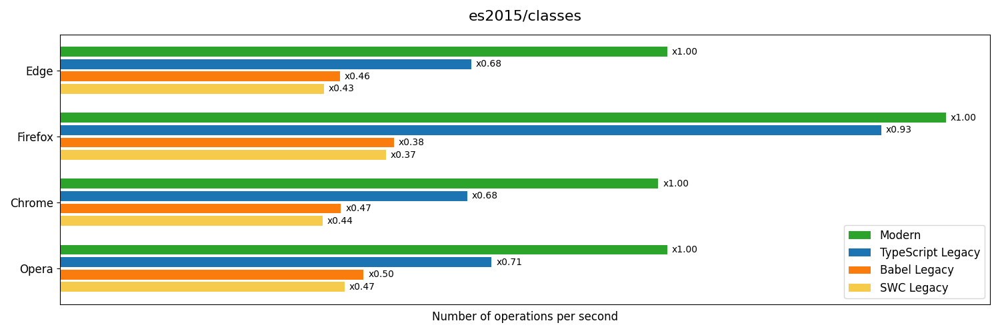

  

    Box plot
  

  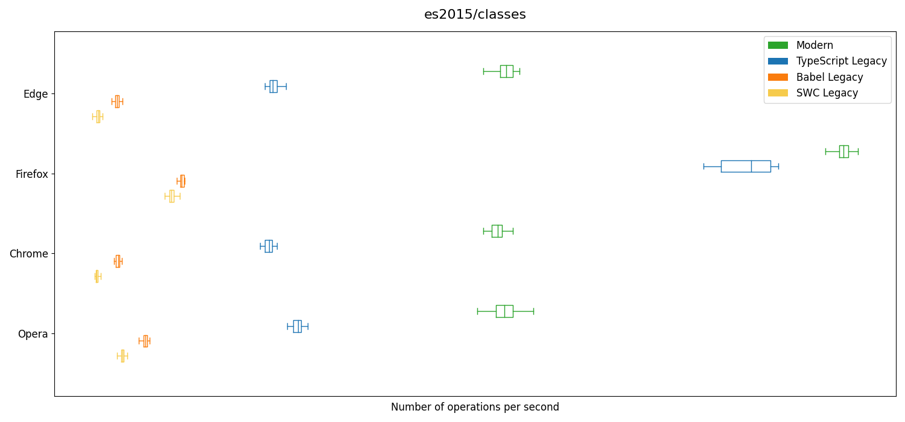

### es2015/default-parameters

Source code: [code](../src/es2015/default-parameters.ts)

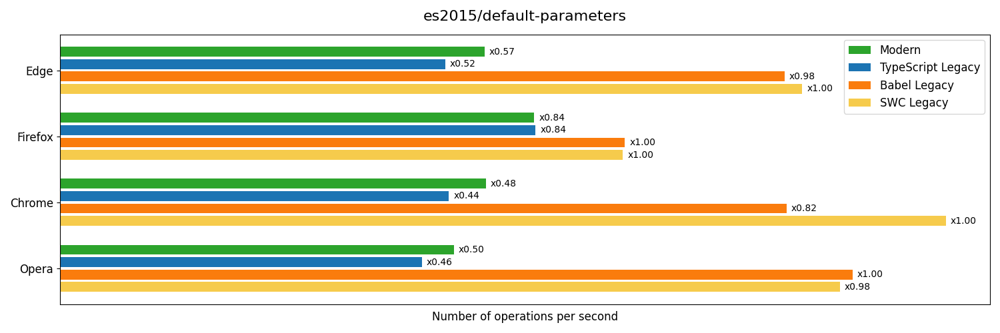

  

    Box plot
  

  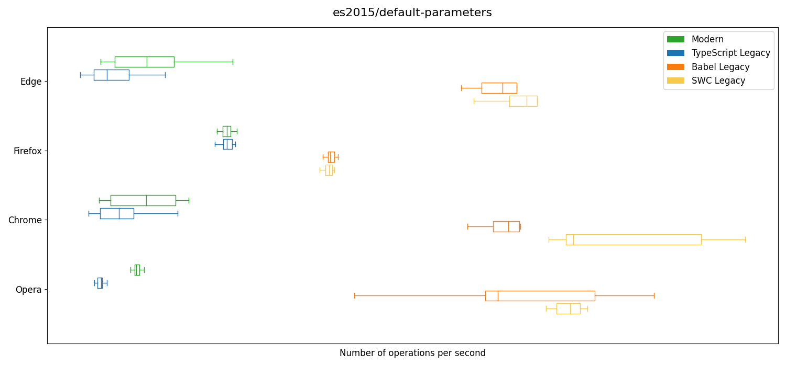

### es2015/for-of-iterators

Source code: [code](../src/es2015/for-of-iterators.ts)

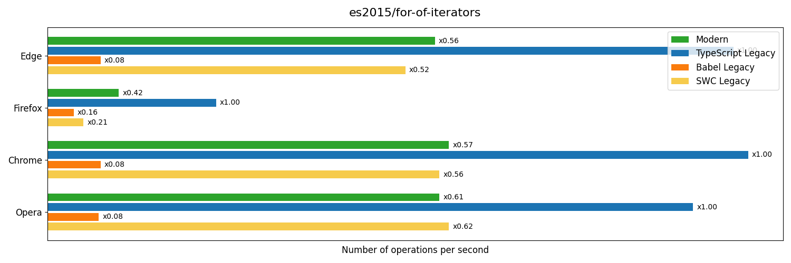

  

    Box plot
  

  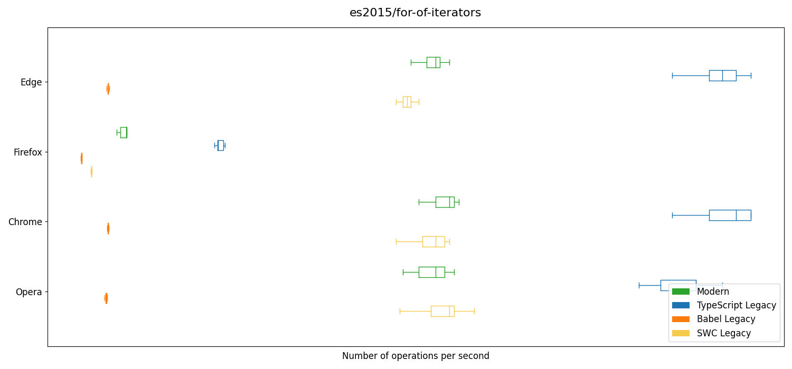

### es2015/generators

Source code: [code](../src/es2015/generators.ts)

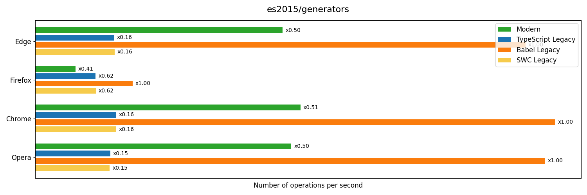

  

    Box plot
  

  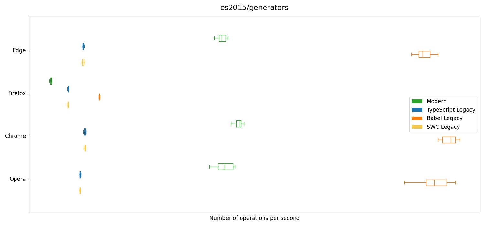

### es2015/rest-parameters

Source code: [code](../src/es2015/rest-parameters.ts)

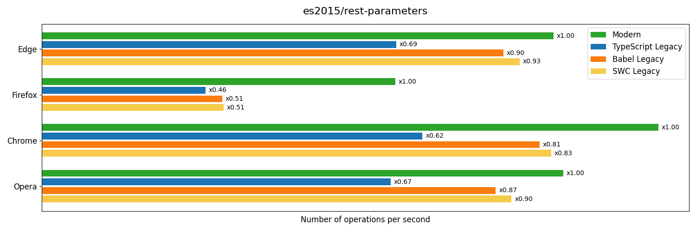

  

    Box plot
  

  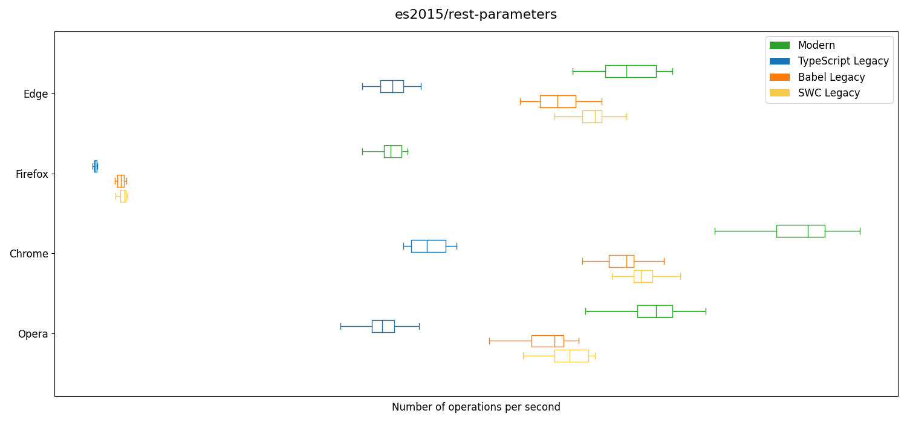

### es2015/spread-operator

Source code: [code](../src/es2015/spread-operator.ts)

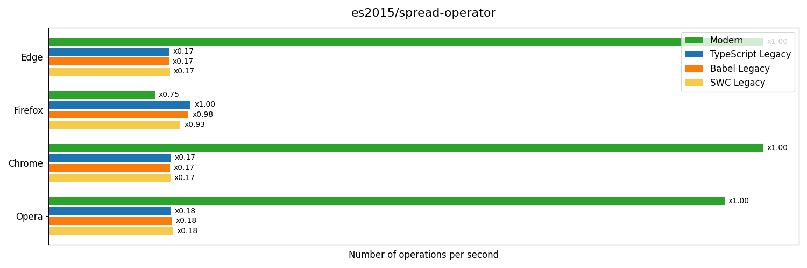

  

    Box plot
  

  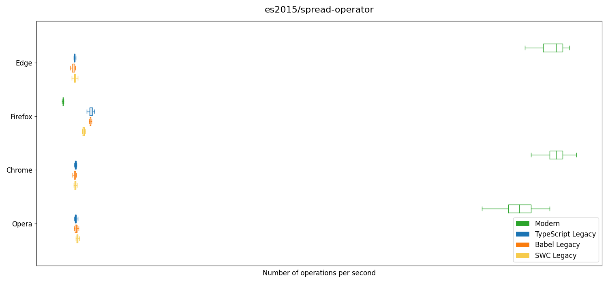

### es2015/template-literals

Source code: [code](../src/es2015/template-literals.ts)

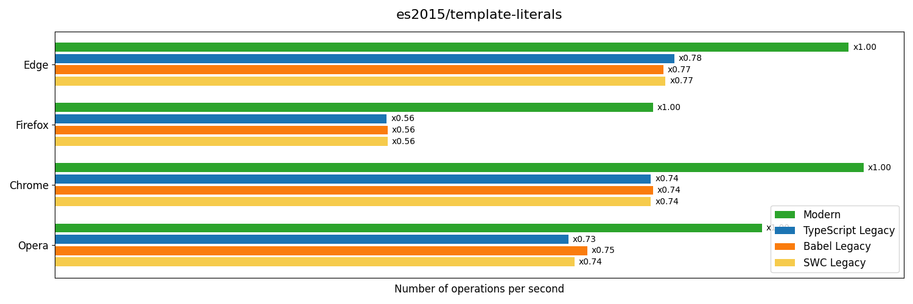

  

    Box plot
  

  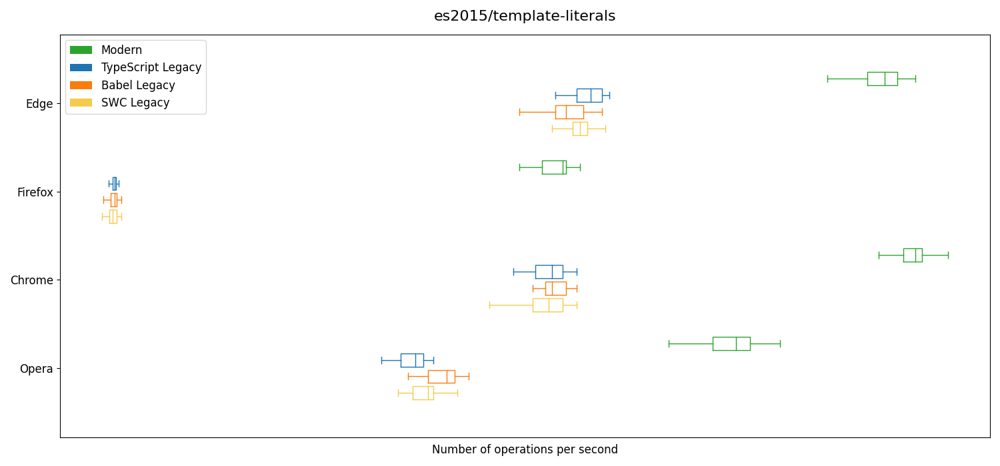

### es2016/exponential-operator

Source code: [code](../src/es2016/exponential-operator.ts)

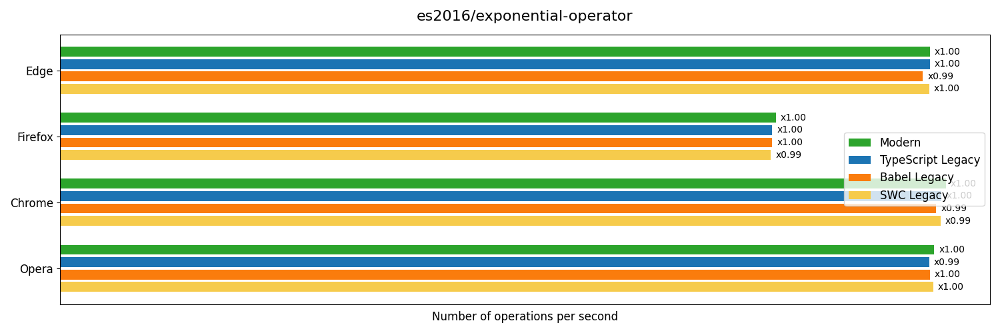

  

    Box plot
  

  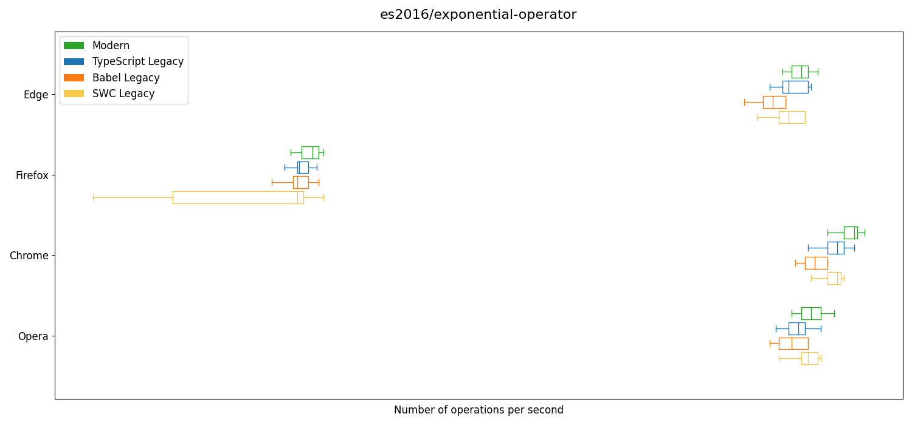

### es2017/async-functions

Source code: [code](../src/es2017/async-functions.ts)

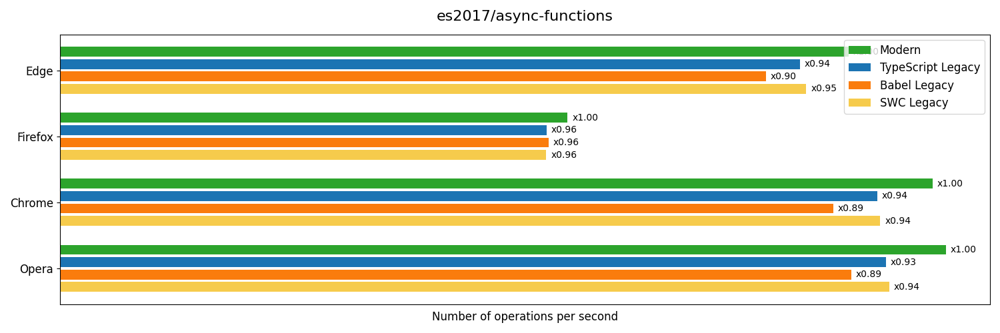

  

    Box plot
  

  

### es2018/rest-object-arguments

Source code: [code](../src/es2018/rest-object-arguments.ts)

  

    Box plot
  

  

### es2018/rest-object

Source code: [code](../src/es2018/rest-object.ts)

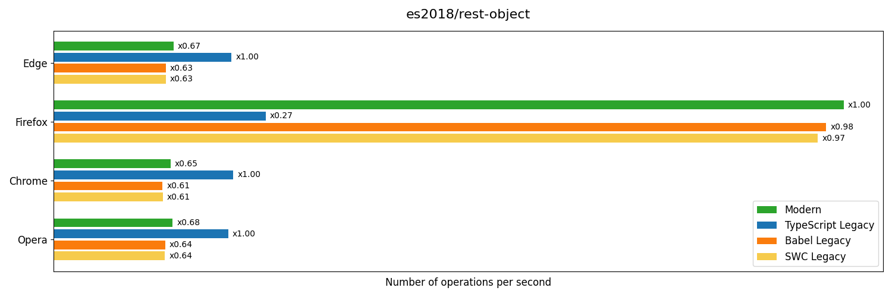

  

    Box plot
  

  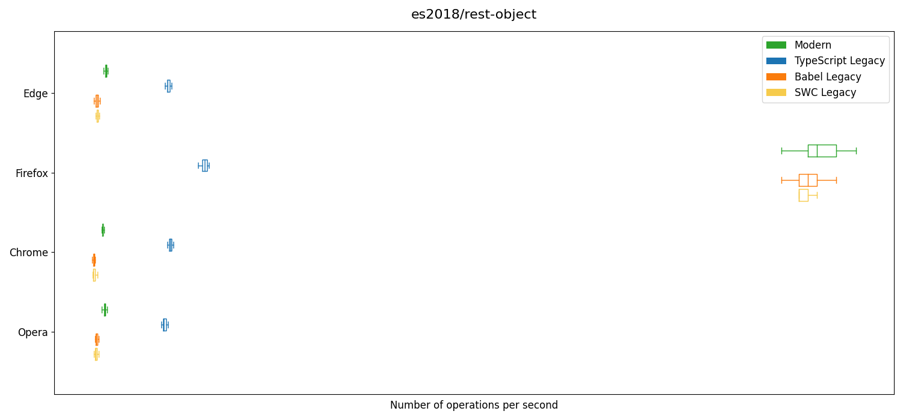

### es2018/spread-after

Source code: [code](../src/es2018/spread-after.ts)

  

    Box plot
  

  

### es2018/spread-replace-many

Source code: [code](../src/es2018/spread-replace-many.ts)

  

    Box plot
  

  

### es2018/spread-replace-number-fields

Source code: [code](../src/es2018/spread-replace-number-fields.ts)

  

    Box plot
  

  

### es2018/spread-replace

Source code: [code](../src/es2018/spread-replace.ts)

  

    Box plot
  

  

### es2019/private-class-variables

Source code: [code](../src/es2019/private-class-variables.ts)

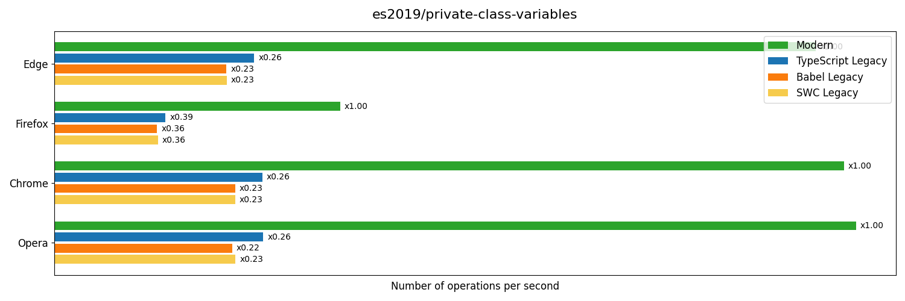

  

    Box plot
  

  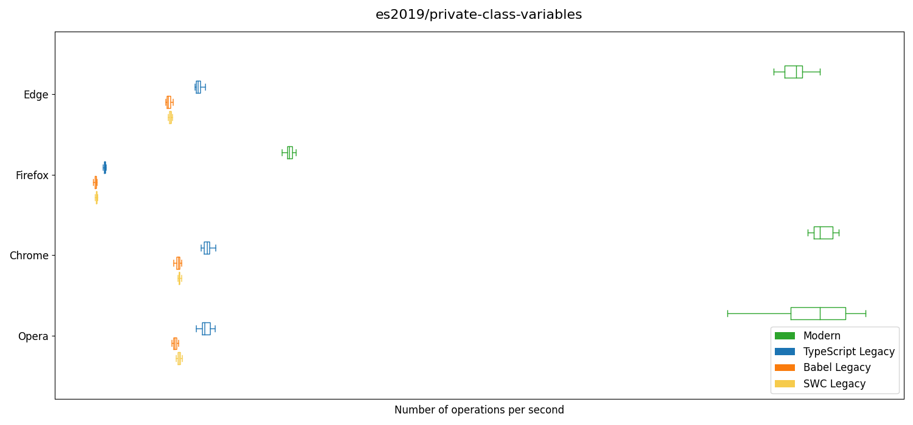

### es2020/optional-chaining

Source code: [code](../src/es2020/optional-chaining.ts)

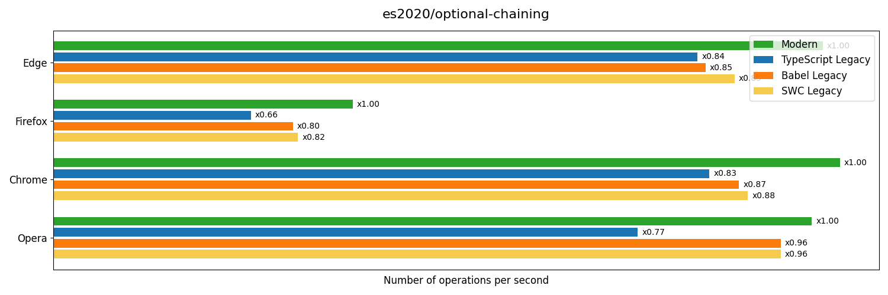

  

    Box plot
  

  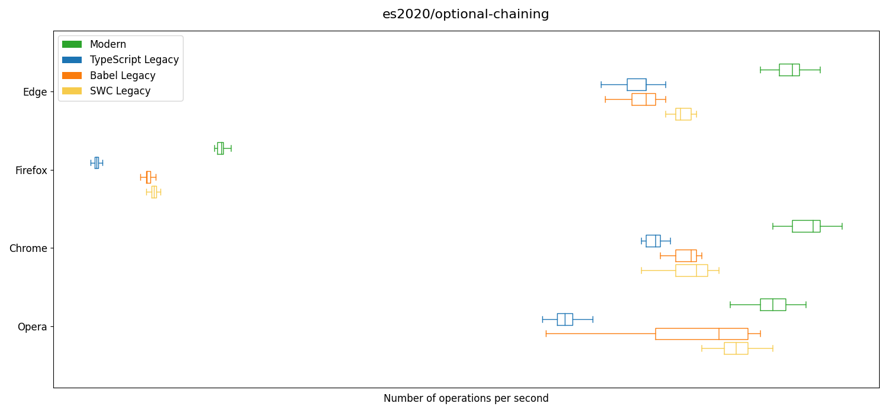

