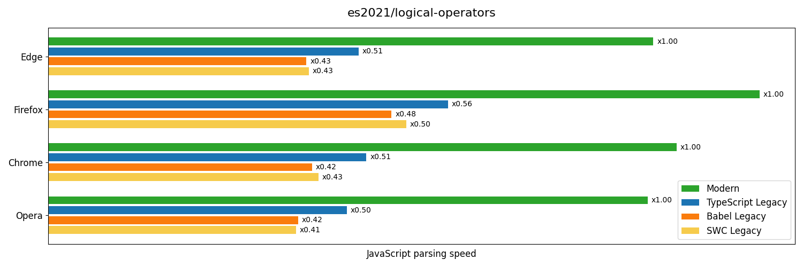
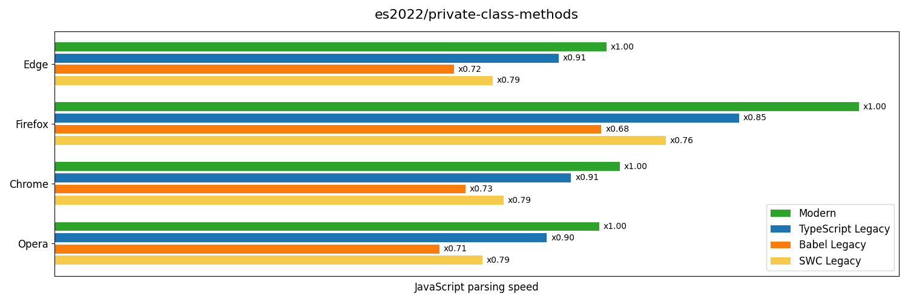

# EcmaScript Syntax Features Benchmark

This file contains results of benchmarking parsing speed of
EcmaScript features. Each feature is tested in ESNext and ES5
standards. ES5 standard is compiled by several instruments -
Babel, SWC and TypeScript. Also, each feature is tested in
several popular browsers.
## System info: Windows, AMD64

### es2021/logical-operators

Source code: [code](../src/es2021/logical-operators.ts)

  

    Box plot
  

  

### es2022/private-class-methods

Source code: [code](../src/es2022/private-class-methods.ts)

  

    Box plot
  

  

